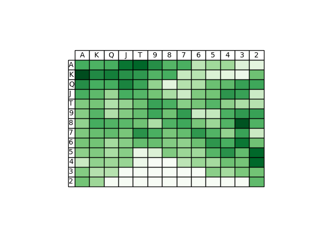
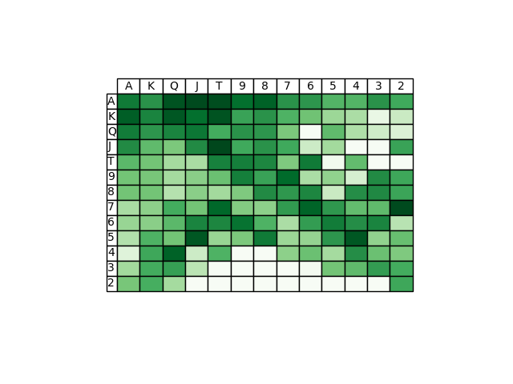
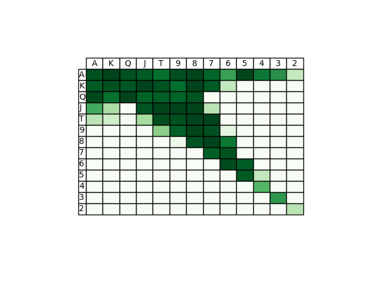

# DeeperStack

This is an implementation of [DeepStack](https://www.deepstack.ai/s/DeepStack.pdf)
for No Limit Texas Hold'em, extended from [DeepStack-Leduc](https://github.com/lifrordi/DeepStack-Leduc).

## Setup

Running any of the DeeperStack code requires [Lua](https://www.lua.org/) and [torch](http://torch.ch/). Please install torch with lua version 5.2 instead of LuaJIT. Torch is only officially supported for \*NIX based systems (i.e. Linux and Mac OS X). Read `torch/prepare.sh` for more information about how to setup the torch environment.

Connecting DeeperStack to a server or running DeeperStack on a server will require the [luasocket](http://w3.impa.br/~diego/software/luasocket/)
package. This can be installed with [luarocks](https://luarocks.org/) (which is
installed as part of the standard torch distribution) using the command
`luarocks install luasocket`. Visualising the trees produced by DeeperStack
requires the [graphviz](http://graphviz.org/) package, which can be installed
with `luarocks install graphviz`. Running the code on the GPU requires
[cutorch](https://github.com/torch/cutorch) which can be installed with
`luarocks install cutorch`.

### Hand ranks
The HandRanks file was too big for github, so you will need to unzip it:
```
cd Source/Game/Evaluation && unzip HandRanks.zip
```

### scatterAdd
When you try to run DeeperStack, you will eventually run into a problem where `scatterAdd` is not defined.
Torch7 actually includes a C++ implementation of scatterAdd but for whatever reason, doesn't include a lua
wrapper for it.

I've included `TensorMath.lua` files in the torch folder of this repository that include the wrapper functions for both CPU and GPU. Copy them to their corresponding torch installation folders.

Now, from your torch installation directory, run:

```
$ ./clean.sh
$ TORCH_LUA_VERSION=LUA52 ./install.sh
```

and you should be good to go.

## Performance

This implementation was tested against Slumbot 2017, the only publicly playable bot as of June 2018. The action abstraction used was half pot, pot and all in for first action, pot and all in for second action onwards. It achieved a baseline winrate of **42bb/100** after 2616 hands (equivalent to ~5232 duplicate hands). Notably, it achieved this playing inside of Slumbot's action abstraction space.


A comparison of preflop ranges was also done against [DeepStack's hand history](https://www.deepstack.ai/s/DeepStack_vs_IFP_pros.zip), showing similar results.

| Action                  | DeepStack                           | DeeperStack                    |
| ---                     | ---                                 | ---                            |
| Open fold               | |   |
| Open pot                |  |    |
| 3bet pot after pot open | |   |

Average thinking speed comparison:

| Street  | DeepStack Thinking Speed (s) | DeeperStack Thinking Speed (s) |
| ---     | ---                          | ---                            |
| Preflop | 0.2                          | 2.69                           |
| Flop    | 5.9                          | 12.42                          |
| Turn    | 5.5                          | 7.57                           |
| River   | 2.1                          | 3.33                           |

DeeperStack using a NVIDIA Tesla P100.
DeepStack using a NVIDIA GeForce GTX 1080.

Training details:

| Network             | # samples | # poker situations | Validation huber loss | Epoch |
| ---                 | ---       | ---                | ---                   | ---   |
| River network       | 100,000   | 1,000,000          | 0.0415                | 54    |
| Turn network        | 100,000   | 1,000,000          | 0.045                 | 52    |
| Flop network        | 100,000   | 1,000,000          | 0.013                 | 52    |
| Preflop aux network | 100,000   | 1,000,000          | 0.0017                | 67    |

Training data and Validation Huber Loss comparison:

| Network             | DeepStack # ps | DeepStack vhb | DeeperStack # ps | DeeperStack vhb |
| ---                 | ---            | ---           | ---              | ---             |
| River network       | (no used)      | (no used)     | 1,000,000        | 0.0415          |
| Turn network        | 10,000,000     | 0.026         | 1,000,000        | 0.045           |
| Flop network        |  1,000,000     | 0.034         | 1,000,000        | 0.013           |
| Preflop aux network | 10,000,000     | 0.000055      | 1,000,000        | 0.0017          |

Note that:
* ps: poker situation
* vhb: validation huber loss

If you need to extract Neural network information, just type `th` and:
```
$ torch.load('final_cpu.info')
{
  gpu : false
  epoch : 54
  valid_loss : 0.041533345632636
}
```

## Samples Math

A training sample is composed of 2 files:
 * inputs
 * targets

By default, each training sample contains 10 poker situations (params.gen_batch_size).

If you want to generate 1,000,000 poker situations to train your network, you will need to configure following parameter (Source/Settings/arguments.lua):

```
params.train_data_count = 1000000
```

Just to make sure that you understand it:
 * You will need to have 200,000 files.
 * You will need to have 100,000 training samples.
 * You will need to have 1,000,000 poker situations.

```
200,000 files = 100,000 training samples = 1,000,000 poker situations
```

## Training your models

DeeperStack is not a single neural network. DeeperStack is composed of four networks:
 * River network
 * Turn network
 * Flop network
 * Preflop aux network

Remember that to generate training data for a network, you will need to have the precedent network trained.

The workflow should be:

```
River -> Turn -> Flop -> Preflop aux
```

Preflop aux is already included, so you won't need to train it if you want.

In the future, if you want to train your neural network with more poker situations, you will have to generate again preflop, flop and turn samples. This is because turn poker situations depends on river model (and the same for flop because depends on turn model...).

## Abstraction actions

DeepStack uses following actions to generate poker situations:
 * Fold.
 * Call/Check.
 * Bet Half Pot (0.5p).
 * Bet Pot (1p).
 * All-in.

DeeperStack uses following actions:
 * Fold.
 * Call/Check.
 * Bet Pot (1p).
 * All-in.

You can add more actions in parameter configuration file:

```
params.bet_sizing = {{1},{1},{1}}
```

You can't remove following actions:
 * Fold.
 * Call/Check.
 * All-in.

## Creating your own models

Other than the preflop auxiliary network, the counterfactual value networks are not included as part of this release, you will need to generate them yourself. The model generation pipeline is a bit different from the Leduc-Holdem implementation in that the data generated is saved to disk as raw solutions rather than bucketed solutions. This makes it easier to experiment with different bucketing methods.

Here's a step by step guide to creating models:

1. `cd Source && th DataGeneration/main_data_generation.lua 4`
2. Wait for enough data to be generated.
3. `th Training/raw_converter.lua 4`
4. `th Training/main_train.lua 4`
5. Models will be generated under `Data/Models/NoLimit`. Pick the model you like best and place it inside
   `Data/Models/NoLimit/river` along with its .info file. Rename them to `final_gpu.info` and `final_gpu.model`.
   Please refer to the [DeepStack-Leduc](https://github.com/lifrordi/DeepStack-Leduc/blob/master/doc/manual/tutorial.md) tutorial if you want to convert them to CPU models.
6. Repeat steps 1-5 for turn and flop by replacing `4` with `3` or `2` and placing the models under the turn and flop folders.

By default, data generation and model training uses GPU, if you want to disable it, just modify `Settings/arguments.lua` to `params.gpu = false`.

## Playing against DeeperStack

`Player/manual_player.lua` is supplied so you can play against DeeperStack for preflop situations. If you want
DeeperStack to work for flop, turn and river, you will need to create your own models.

1. `cd ACPCServer && make`
2. `./dealer testMatch holdem.nolimit.2p.reverse_blinds.game 1000 0 Alice Bob`
3. 2 ports will be output, note them down as port1 and port2
4. Open a second terminal and `cd Source && th Player/manual_player.lua <port1>`
5. Open a third terminal and `cd Source && th Player/deepstack.lua <port2>`. It will take about 20 minutes to
load all the flop buckets, but this is actually not necessary until you've created your own flop model. You can
skip the flop bucket computation by commenting out line 44 of `Source/Nn/next_round_value_pre.lua`.
6. Once the deepstack player is done loading, you can play against it using manual_player terminal. `f` = fold,
`c` = check/call, `450` = raise my total pot commitment to 450 chips.

## Playing vs Slum Bot

Slum bot is available to play online in this page: http://www.slumbot.com/

There is a script in Python that you can use to play versus Slum Bot.

1. Install Python 2.7
2. Install pip
3. Install Selenium using pip `pip install -U selenium`
3. Start the deepstack server using command `th Player/deepstack_server.lua 16177`
4. `cd Source && python Player/slumbot_player.py localhost 16177`
5. Wait for enough data to be generated.

## Differences from the original paper

- A river model was used instead of solving directly from the turn.
- Different neural net architecture.
  - Batch normalization layers were added in between hidden layers because they were found to improve huber loss.
  - Only 3 hidden layers were used. Additional layers didn't improve huber loss, in agreement with the paper.
- Preflop solving was done with auxiliary network only, whereas paper used 20 iterations of flop network.
  - Because of this, the cfvs for a given flop must be calculated after seeing it by solving the preflop again with the current flop in mind.
- During re-solving, the opponent ranges were not warm started.

## Future work

- Warm start opponent ranges for re-solving
- Speed up flop solving (use flop network during preflop solving?)
- Support LuaJIT
- C++ implementation?

## References

DeepStack Paper & Supplements: https://www.deepstack.ai/downloads

## Documentation

The documentation for code files was automatically generated with [LDoc](https://github.com/stevedonovan/LDoc), which can be installed with `luarocks install ldoc`. To re-generate the docs, run `ldoc .` in the `doc/` directory. If you wish to also generate documentation for local functions, run `ldoc . -all` instead.
